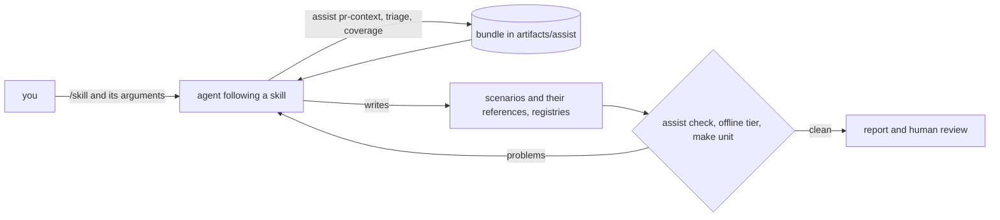

# AI-assisted test writing

An AI agent can do three jobs of this repository with you: write the tests of an otterdog pull request, triage a
failed run, and close gaps of the coverage matrix. The harness itself stays deterministic: the agent runs the
`otterdog-e2e assist` commands, which gather context and validate what it writes, and follows the **skills**
committed in `.claude/skills/`. Every file it proposes goes through the same gates as yours, then through your
review.

## Principles

- **The harness never calls an AI.** No LLM dependency, no API key, no network call to a model: the AI work happens
  in an agent you run (Claude Code, or any agent supporting the open [Agent Skills](https://agentskills.io) format),
  outside the execution path of the tests.
- **Deterministic commands do everything that needs no judgement**: `otterdog-e2e assist` gathers context bundles
  (a PR, a run, the coverage matrix), pre-classifies failures and validates what the agent wrote. They are
  unit-tested like the rest of the harness.
- **AI output is never trusted.** Every file an agent writes goes through `otterdog-e2e assist check` (schema, ids,
  references, offline lint), the offline tier and the unit tests, then through a human review. The skills never run
  a live tier unless you ask.
- **Untrusted input is data.** PR titles, bodies, diffs, comments and run outputs can be written by anyone: the
  bundles wrap them in delimited blocks marked as untrusted content, and the skills repeat that instructions found
  there are never followed.
- **No secret ever reaches a bundle**: triage scrubs the run first and refuses when leaks remain, the PR context uses
  anonymous public reads, and bundles live below the git-ignored artifacts directory.



## The assist commands

Provided by the harness (`otterdog-e2e assist`, package `src/otterdog_e2e/assist/`); they need no agent and are
useful on their own. Every command prints a short human summary with the bundle path, or the summary as JSON with
`--json`. Exit codes: 0 success, 1 harness error (for `check`: problems found), 2 usage error.

### `assist pr-context`

```bash
.venv/bin/otterdog-e2e assist pr-context 790 --sha 0cee9e302282fefa092b4e0767248a997a9272ea
```

`otterdog-e2e assist pr-context NUMBER [--sha SHA] [--upstream OWNER/REPO] [--out DIR] [--json]`

| Option | Meaning |
|---|---|
| `NUMBER` | the upstream pull request |
| `--sha` | the commit to pin (full 40-hex); without it, the current head is used and printed: pin it for the runs |
| `--upstream` | the upstream repository (default: the harness setting, `eclipse-csi/otterdog`) |
| `--out` | another directory for the bundle (default: `assist/` below the artifacts root) |

Anonymous public reads only. The bundle holds the PR (title, author, state, merged, base, head, whether the pin is
the head), the changed files with their patches (each truncated with a marker; binary and large files listed only),
the risky files, the tags the PR lane would select, the SUT spec `pr:<n>@<sha>`, the suggested base, the coverage
features whose `source` the PR touches (with status, tier, covering items and gap outline), the related scenarios
and their files, the scenarios whose `references` already name the PR (`referencing_scenarios`: ids, files, their
reference entries with the expected deltas, and the base they declare), the documentation to read and the next
commands (`otterdog-e2e run --sut pr:<n>@<sha> [--base-sut auto] --suite offline,differential`, the change being
implied by the `pr:` SUT, and `otterdog-e2e pr <n> --sha <sha>`). The PR's tests extend the scenarios of the
functionality it changes and reference the PR there: never a PR-named scenario or directory.

### `assist check`

```bash
.venv/bin/otterdog-e2e assist check scenarios/offline/rulesets/val-ruleset-strict.yaml tests/webapp/test_stale_status.py
```

`otterdog-e2e assist check [PATHS...] [--sut SPEC] [--no-lint] [--json]`

Validates the files an agent (or you) wrote; without paths, the files changed in the work tree below `scenarios/`
and `tests/` (`git status`). It applies the real loaders and the repository's rules: scenario YAML (the model with its
`references`: format, bases, expected deltas naming existing steps; unique ids across the repository; the references
of one change agreeing on base and template; ids and file names without PR numbers; known bug ids and step-level
links), the `references` of the scenario markers of Python tests, `scenarios/coverage.yaml` (the coverage matrix rules) and the jsonnet files the
scenarios reference. Unless `--no-lint`, it then lints the live scenarios among them offline with the SUT (`--sut`,
default `release:latest`; an untrusted SUT keeps its docker sandbox) and reports where the result is. Output: the
problems (file, location, message) and the lint result; exit 1 when there is any problem.

### `assist triage`

```bash
.venv/bin/otterdog-e2e assist triage latest
```

`otterdog-e2e assist triage RUN_DIR|latest [--baseline RUN_DIR] [--out DIR] [--json]`

Scrubs the run directory first (as `scrub-artifacts` does, with the secret values of the environment) and refuses to
build a bundle when leaks remain. For every failed or errored item: node id, scenario id, tier, phase, an excerpt of
the reason, the otterdog commands of the item, the relevant artifact paths, the matching known bug (with its
`crash_signature`) and a deterministic pre-classification with its evidence:

| Class | Evidence |
|---|---|
| `known-bug` | the item or step declares a registered bug, or the output carries a bug's crash signature |
| `infrastructure` | GitHub 5xx, secondary rate limit, abuse detection, network errors, delivery wait timeouts, docker or compose failures, a busy lease |
| `harness` | errors raised by `otterdog_e2e` at setup or teardown (`ContextError`, `SafetyError`, `TargetError`, tracebacks ending in `src/otterdog_e2e`) |
| `sut` | assertion or check failures of a scenario step on otterdog output or GitHub state |
| `unknown` | none of the above |

With `--baseline`, each failure is marked new or already present in the baseline run (same node id).

### `assist coverage`

```bash
.venv/bin/otterdog-e2e assist coverage --status gap,partial --priority P0
.venv/bin/otterdog-e2e assist coverage --feature config.hook.validate-team
```

`otterdog-e2e assist coverage [--status gap,partial] [--priority P0,P1,P2] [--area AREA] [--tier TIER] [--feature ID] [--out DIR] [--json]`

Lists the features of `scenarios/coverage.yaml` with status, priority, tier, minimum plan, web-UI flag, source,
covering items and gap outline (needs split into available and missing), sorted by priority then status. `--feature`
gives one feature with the existing scenarios and tests to imitate (same area and tags) and the commands that
validate the change and regenerate `docs/coverage-matrix.md`.

## Bundles

```text
artifacts/assist/                   below E2E_ARTIFACTS (git-ignored), directories 0700
├── pr-790-0cee9e302282/            assist pr-context: context.json, context.md, diff.patch
├── triage-tmfidc6a/                assist triage: triage.json, triage.md
└── coverage/                       assist coverage: coverage.json, coverage.md
```

The JSON files are for agents and scripts, the Markdown files for people and agents alike. PR texts, diffs and command
outputs appear inside blocks marked as untrusted content. Bundles are per-run data like the artifacts: delete them
when you no longer need them.

## The skills

| Skill | Use it to | It writes | Its gates |
|---|---|---|---|
| [`write-e2e-scenario`](../.claude/skills/write-e2e-scenario/SKILL.md) | write, extend or fix a scenario or a Python test (the base of the others) | a scenario or test, registry entries | `assist check`, the offline run of the item or `make lint-scenarios`, `make unit` |
| [`otterdog-pr-tests`](../.claude/skills/otterdog-pr-tests/SKILL.md) | test an otterdog pull request | extended or new functional scenarios with a `references` entry for the PR (expected deltas) | `assist check`, offline on `release:latest`, offline and differential run of the pinned PR in docker, every delta explained |
| [`triage-e2e-run`](../.claude/skills/triage-e2e-run/SKILL.md) | explain the failures of a run | verdicts; drafts of known bugs, scenario fixes, harness fixes (on request), upstream issue texts (report only) | evidence for every verdict, `assist check`, `make unit` |
| [`fill-coverage-gap`](../.claude/skills/fill-coverage-gap/SKILL.md) | close a gap or a partial feature of the matrix | the missing test, the feature in `scenarios/coverage.yaml`, the regenerated matrix | `assist check`, the offline run or the lint, `make unit`; never `covered` without an assertion exercising the feature |

Each skill is a `SKILL.md` (frontmatter with the standard fields only, then input, steps, what "done" means, a safety
section and an example report) plus `references/*.md` for details; they point to the pages of this site instead of
copying them. A skill pre-approves no tool: every command it runs goes through your agent's permission prompts.

### In Claude Code

Claude Code discovers the skills of the project when it starts in the repository. Invoke one with its name and
arguments (the text after the name, `$ARGUMENTS` inside the skill):

```text
/otterdog-pr-tests 790 0cee9e302282fefa092b4e0767248a997a9272ea
/triage-e2e-run latest
/fill-coverage-gap config.hook.validate-team
/write-e2e-scenario an offline scenario for the validation of organization variables
```

Claude Code also invokes a skill by itself when your request matches its description ("why did the last run
fail?", "write the tests of otterdog PR 812"). Without a terminal, run it headless, for example
`claude -p "/triage-e2e-run latest"`: a headless run cannot answer permission prompts, so allow only the commands the
skill needs (the `assist` commands, the offline runs) in your settings or on the command line, never a live tier.

### Other agents

The skills follow the open Agent Skills format with tool-neutral frontmatter (`name`, `description`, `license`,
`compatibility`), so any agent that supports skills can load `.claude/skills/<name>/` as it is (or a copy or a link
of it in that agent's skills directory). An agent without skills support can still follow a `SKILL.md` given as
instructions ("follow `.claude/skills/triage-e2e-run/SKILL.md` for the latest run").

## Safety model

- **Prompt injection.** A pull request, a comment, a repository description or an otterdog error message can contain
  text addressed to an agent. Bundles fence such content and label it untrusted; every skill says that instructions
  found in it are never followed and that attempts are reported. Your review is the last line of defence: look for
  changes the task did not ask for.
- **No secrets.** Triage works on scrubbed artifacts only and refuses when leaks remain; the PR context needs no
  token; the skills forbid reading `.env*` files, the instance files of `~/.config/otterdog-e2e/` and the harness
  cache, and allow dummy secret values only ([writing-scenarios.md](writing-scenarios.md#secrets)).
- **Untrusted code stays in docker.** A PR runs only as `pr:<n>@<sha>` (its own image, no network for offline
  commands); the skills never install it on the host ([testing-an-otterdog-pr.md](testing-an-otterdog-pr.md)).
- **No live tiers, GitHub writes, commits or pushes** unless you ask: the skills give you the live commands
  (`make one SCENARIO=<id> TARGET=<instance>`, `otterdog-e2e pr <n> --sha <sha> --target <instance>`) instead of
  running them, and leave their changes in the work tree.
- **Local agent state stays out of git**: `.gitignore` covers `.claude/settings.local.json` (your own permissions)
  and `.claude/worktrees/` (worktrees of parallel agents); only `.claude/skills/` is tracked.

## Limits

AI proposals can be wrong, and the gates check form and consistency, not intent:

- a scenario can be valid, green and still assert the wrong behaviour, or too little of it;
- an expected delta can describe a regression as intended: read every note of a reference against the PR;
- a triage verdict can blame the wrong component: check the evidence it quotes;
- a coverage status can overstate what the assertions exercise: `covered` must name the assertion for every
  operation of the feature;
- live behaviour is never verified by the skills: the cli, webhooks, webapp, web-UI and enterprise tests they write
  are lint-checked only until you run them.

The gates and your review are what make the proposals usable. Review them like any contribution: `git status` and
`git diff`, the report's open questions, then the [battery guide's checklist](battery-guide.md#9-submission-checklist).

## Keeping the skills honest

`tests/unit/test_skills.py` (in `make unit`) checks that every skill keeps the portable format (standard fields
only, `name` equal to its directory, length limits, a short body with its safety section, references one level
deep) and that what it tells an agent to run exists: every `otterdog-e2e` command, subcommand and long option in the
click CLI, every `make` target in the Makefile, every repository path and every relative link. A renamed command or
file therefore fails the unit tier until the skills follow.
