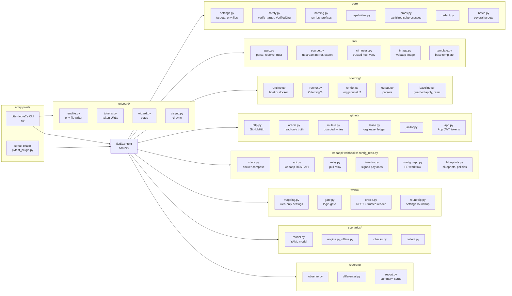
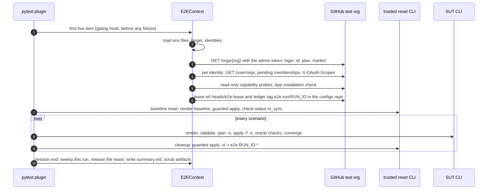
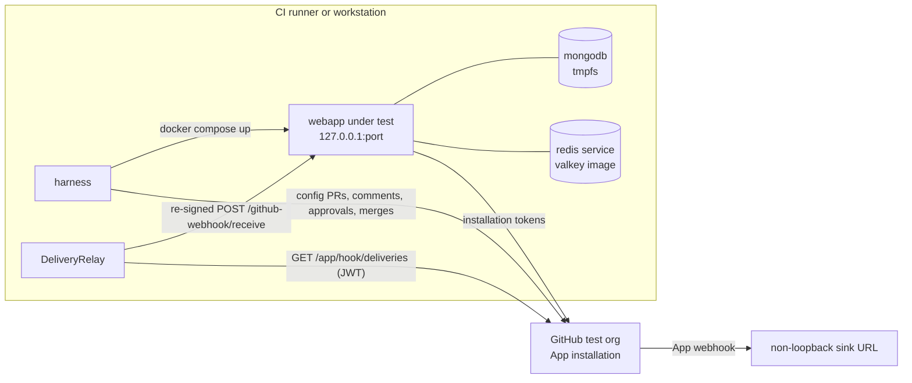
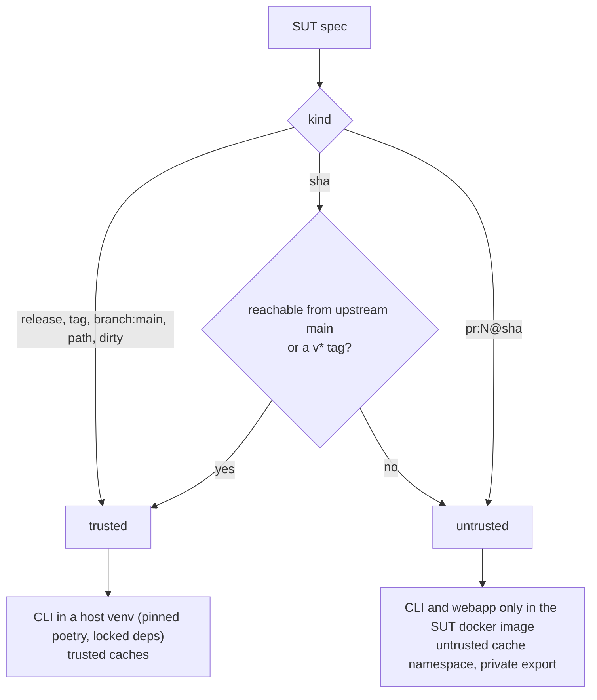
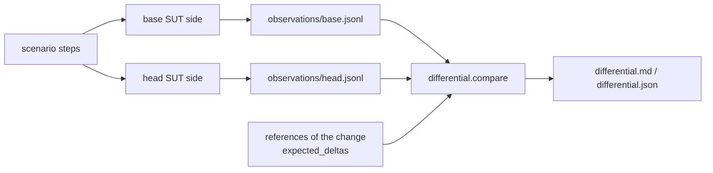

# Architecture

otterdog-e2e is a Python package (`src/otterdog_e2e`) with two entry points that share one composition root:

- the `otterdog-e2e` command line (the `cli/` package, click; also `python -m otterdog_e2e`), for operations
  (doctor, bootstrap, janitor, relay, reports, the onboarding commands `setup` and `ci-sync`) and for starting test
  sessions (`run`, `pr`, which call `pytest.main` in-process for one target, and start one child process per target
  for several); `cli/common.py` holds the click group and the helpers every command shares, and each command family
  has its module (`doctor`, `bootstrap`, `sut`, `run`, `ops`, `maintenance`, `app_manifest`, `inject`, `onboarding`,
  `assist`);
- a pytest plugin (`pytest_plugin.py`, registered through the `pytest11` entry point), which turns tiers, scenario
  YAML files and markers into test items, gates them and reports them.

Both build an `E2EContext` (the `context/` package): the settings, the run context, the target, the verified
organization, the capabilities, the org lease, the SUTs and every client and driver of a session. `context/core.py`
assembles it from one class per facet over the shared state of `context/state.py`: `live` (target, verification,
GitHub clients, App, org lease), `sut` (SUTs, otterdog drivers, differential sides), `webui`, `webapp` and `rundata`
(scenario variables, rate budget, known bugs, change under test).

**Instances and profiles.** A target file `targets/<profile>.yaml` is a profile (`free`, `team`, `enterprise`) and
holds no org-specific value; an instance is one test organization, named by `--target <instance>`, whose env file
`~/.config/otterdog-e2e/<instance>.env` holds its organization, ids, logins, tokens and `E2E_PROFILE`.
`settings.resolve_target_ref` maps a `--target` value to the instance, its profile and the file; `Target.name` is the
instance and `Target.profile` the profile. A session serves one instance: env files fill the environment without
overriding it, so `batch.py` runs several targets as one child process each (`procs.run_harness`, the parent's
pristine environment, redacted and prefixed output, forwarded signals), sequentially or `--parallel` on distinct
organizations (and distinct external webapps), refuses exported per-instance values that would serve every target,
and writes the batch summary. `onboard/` writes the env file of an instance interactively (`setup`)
and its CI environments through the operator's `gh` login (`ci-sync`); see [onboarding.md](onboarding.md).

## Components



| Area | Modules | Role |
|---|---|---|
| core | `settings`, `safety`, `naming`, `capabilities`, `procs`, `redact`, `waiting`, `batch` | target files (profiles), instances and env files, the verified-org capability object, run ids and resource names, plan/probe capabilities, sanitized subprocesses (and the harness children of a batch), secret redaction, polling helpers, target lists and batch runs |
| onboarding | `onboard/envfile`, `onboard/tokens`, `onboard/wizard`, `onboard/cisync` | the only writer of env files (atomic, 0600), the token requirements and prefilled creation URLs per role, the interactive `setup` of an instance, the CI environments, variables and secrets of `ci-sync` |
| SUT | `sut/spec`, `sut/source`, `sut/version`, `sut/cli_install`, `sut/image`, `sut/template` | resolve a spec to a commit, export it from a blob-less mirror, compute its version, install its CLI (trusted only) or build its docker image, choose its base template |
| otterdog driver | `otterdog/runtime`, `runner`, `workspace`, `render`, `output`, `baseline` | run the CLI on the host or in a container, prepare workspaces (`otterdog.json`, org config), render the two-layer org config, parse validate/plan/apply output, guard deletions and reset the org |
| GitHub | `github/http`, `oracle`, `mutate`, `lease`, `janitor`, `app` | one HTTP client with retries, rate-limit handling and write guards; independent read-only ground truth; harness writes; the GitHub-side org lease and run ledger; leftovers cleanup; GitHub App authentication |
| webapp and webhooks | `webapp/stack`, `webapp/api`, `webhooks/*`, `config_repo`, `blueprints`, `resources/dtrack_mock` | the compose stack of the webapp under test (services stopped and started, environment overrides, the Dependency-Track mock of profile `dtrack`), its REST API and pages, webhook signing and injection (raw bodies, omitted headers, replays), the pull relay of App deliveries, the config-repo PR workflow driver (drafts, reviews, comment edits, adopted run PRs), blueprint and policy definitions with their remediation PRs and workflow runs |
| web UI | `webui/mapping`, `webui/gate`, `webui/oracle`, `webui/roundtrip` (with the web mode of `otterdog/runner`: `WebOtterdogCli`) | the table of the 12 web-only organization settings and its drift check against the SUT's source; the login gate (one bot login at a time per machine, a TOTP window apart, blocked after a failure that retries would make worse); the oracles (REST for 7 settings, a trusted otterdog's `show-live` for the others); the settings round trip (snapshot, set, verify, converge, restore) |
| scenarios | `scenarios/model`, `checks`, `engine`, `offline`, `collect`, `known_bugs`, `selection`, `inject` | YAML scenarios, oracle checks, the live/offline/differential engines, pytest collection, known otterdog bugs, tag selection from changed files, ad-hoc injection of jsonnet files (`otterdog-e2e inject`, `tests/adhoc`) |
| reporting | `observe`, `differential`, `report`, `appmanifest` | observations, base vs head comparison, run summaries (with the coverage matrix of the run), the artifact scrubber, the GitHub App manifest flow |

Rules every module follows: subprocesses only through `procs.run()` (and `procs.run_harness()` for the children of a
batch; a unit test greps for `subprocess.` outside `procs.py`), GitHub HTTP only through `GitHubHttp`, no secret ever
logged or written unredacted.

These components act on GitHub as machine accounts, one per role (`admin`, `oracle`, `author`, `approver`,
`outsider`, `config_reader`): [roles.md](roles.md) describes each role and shows, in diagrams, how a scenario, the
roles, otterdog (CLI and webapp) and the test organization interact.

## Tiers and lanes

| Tier | Needs | Timeout per test |
|---|---|---|
| unit | nothing | none (pytest default) |
| offline | SUT, docker for the webapp part | 300 s |
| cli | target + admin identity | 600 s |
| webhooks | target (+ App) | 900 s |
| webapp | target + App + docker | 900 s |
| enterprise | target with plan enterprise | 600 s |
| web_ui | target + the admin bot's web credentials + `--e2e-allow-web-ui`, a trusted SUT, no SAML SSO | 2100 s |
| differential | `--e2e-base-sut` | 600 s |

The plugin marks every item of a tier directory (`offline`, `live` or `differential`; `tests/web_ui` items are live
and get the `web_ui` marker) and applies the per-tier timeout; a scenario item gets its scenario's `timeout`, or the
tier timeout plus 600 s when it is an `org_level` live scenario. The web_ui timeout covers one web command at the
runner's own timeout (1800 s) plus the oracle checks; the settings round trip sets its own (3600 s). pytest-timeout also times fixture setup, so before the first item runs the plugin installs every SUT and
builds every image the selected items need (`pytest_runtestloop`): no cold install or image build spends an item's
timeout. The timeout of a live item (tier, scenario or explicit marker) covers its test call only (`func_only`): the
live session (verification, probes, the org lease and `E2E_LEASE_WAIT`) is built in `pytest_runtestloop` too, and the
session fixtures the first live item triggers (template clone, first baseline reset) are bounded by the per-command
timeouts of otterdog and the HTTP clients instead; a timeout there would otherwise be cached by the session fixture
and error every later item. An interrupted live setup leaves no live session: it is reported by every live item, and
a session whose org lease is lost (failed renewal) stops being live. Time budgets (checked by `report.py`, overruns flagged in `summary.md`, never failures): offline 10 min per
SUT, P0 cli 30 min (4 min per scenario), P0 webapp 25 min (5 min per PR flow), web_ui 30 min, differential 15 min,
`pr-fast` lane 45 min.

## A live session



The live part of the context is built lazily at the first live item, so offline-only runs never touch GitHub. A
failed live setup (verification, busy lease, missing token) fails every live item with the reason; a missing target
skips them at collection.

Every resource a session creates carries its run id: run ids are `base36(timestamp)` (6 characters) plus 2 hex
characters (`^[0-9a-z]{6}[0-9a-f]{2}$`); names are `e2e-<run>-<slug>` (repositories, teams, rulesets, custom
properties), `E2E_<RUN>_<SLUG>` (secrets, variables), `https://otterdog-e2e.invalid/<run>/<slug>` (webhooks, a host
that never resolves), branches `e2e/<run>/<slug>` and `otterdog/e2e-<run>-<slug>`. The ledger tag registers the run
before it creates anything, so the janitor can later prove which leftovers belong to a run that is over.

## The test battery

The battery is organized by tier (one directory below `tests/` each) and by kind:

| Kind | Where | Run by | For |
|---|---|---|---|
| YAML scenarios | `scenarios/{offline,cli,enterprise}/<domain>/` | `tests/<tier>/test_scenarios.py` (the scenario engines), `tests/offline/test_scenario_lint.py` (every live step validated offline), `tests/differential/` (`observe: true`) | declarative configuration changes: validate, plan, apply, oracle state, convergence ([writing-scenarios.md](writing-scenarios.md)) |
| Python tests | `tests/<tier>/test_*.py` | pytest with the plugin's fixtures | flows YAML cannot express: CLI commands, the webapp PR workflow, App deliveries, the web UI |
| ad-hoc injection | `tests/adhoc/` | `otterdog-e2e inject` | trying jsonnet files without writing a scenario |
| shared jsonnet | `scenarios/fragments/`, `scenarios/lib/` | the scenarios and inject recipes | fragments and helper libraries inlined into the rendered configuration |
| scenario references | `references` of a YAML scenario, `references=` of a `pytest.mark.scenario` marker (`src/otterdog_e2e/changes.py`) | `--change`, `pr` (default: N of a `pr:N@<sha>` SUT) | the otterdog PRs or named changes behind a behaviour: expected differential deltas, base, template; the referencing scenarios pass the tags filter |

Three registries keep the battery honest:

- **the coverage matrix** `scenarios/coverage.yaml`: every otterdog feature (CLI commands and flags, each property of
  the configuration model, validation rules, diff semantics, the webapp's events, commands, tasks and endpoints,
  notable fixes) with its status (`covered`, `partial`, `gap`), the scenario ids and pytest node ids covering it and,
  for partial and gap features, the outline of the missing test. `tests/unit/test_coverage_matrix.py` checks that every
  covering item exists, that the inventory is exhaustive (it parses the example template and pins every command,
  event, task and endpoint) and that [coverage-matrix.md](coverage-matrix.md), generated from the YAML, is current.
  Every run's `summary.md` reports the matrix shares and the features whose covering items ran;
- **the known bugs** `scenarios/known_bugs.yaml` ([known-issues.md](known-issues.md)): an item linked to a bug is a
  non-strict xfail scoped to the exception that reports the bug (`KnownBugReproduced` for a YAML scenario,
  `AssertionError` for a Python test; setup and teardown errors are never covered), so a fix shows up as XPASS and a
  harness error stays a failure; matrix features name the bugs they hit;
- **the scenario catalog** ([scenario-catalog.md](scenario-catalog.md)): the SPEC catalogue ids and their status.

Closing a gap: pick a gap outline of the matrix (it names the scenario id, the file, the steps, the assertions and what
the harness needs; a need starting with `available:` names the API that provides it), write the scenario or test,
move the feature to `partial` or `covered` with the new id in `covered_by`, regenerate the matrix page, then run
`make unit`, `make lint-scenarios` and the offline tier. [battery-guide.md](battery-guide.md) maps each kind of gap to
the harness API, YAML keys, fixtures and check kinds to use.

## Organization configuration

The harness renders one self-contained jsonnet file per step (`resources/org.jsonnet.j2`), in two layers:

1. **baseline**: the live organization profile (plan, billing email, description with the marker, name, ...; fields
   GitHub did not return are hidden, so otterdog leaves them unmanaged), the target's baseline settings, the baseline
   teams (admin, approval, contributors) and repositories (the run's config repository, the configs and defaults
   repositories, the fixture repositories);
2. **scenario**: the fragments of the current step, inserted verbatim.

The base template is imported from `vendor/<repo>/<file>`. Its source depends on the SUT and on the target's
template mode: upstream template at the SUT commit for releases, tags and branches; for other SUTs the template files
are published to the defaults repository under an immutable tag `sut-<label>-<hash8>` and referenced by commit sha.

## Webapp and webhooks



- The stack (`webapp`, `mongodb`, and `redis`, which runs a valkey image) runs with `docker compose -p otterdog-e2e-<run>`; only the webapp is
  published, on 127.0.0.1. Every value reaches compose through the environment of the compose process; the App key
  is a compose secret file in the private scratch directory. `down -v --remove-orphans` always runs.
- No tunnel: the App webhook points at a sink, GitHub records every delivery, and the relay polls the deliveries API,
  filters on the installation and the org, and forwards each payload signed with the webhook secret
  (`X-Hub-Signature`, HMAC-SHA1, the only header otterdog checks) to the local receiver.
- `config_repo.ConfigRepoFlow` drives the config-repo PR workflow (branches, commits, PRs, `/otterdog` comments,
  approvals, merges) and waits for statuses, comments and deliveries, distinguishing "delivery not observed" (infra)
  from "webapp did not react" (SUT). Every PR text is checked by a guard (a `local-plan` with the trusted reset CLI)
  before it is pushed, approved, merged or commented with `/otterdog merge|apply`.
- Transport `external` targets a webapp you run yourself (loopback URL, e.g. `kubectl port-forward`); the session
  still relays the deliveries to it.

## Systems under test and trust



- The upstream mirror is a blob-less bare clone; every git command disables hooks and fsmonitor; trusted refs are
  cross-checked with `git ls-remote`.
- Pull requests must be pinned (`pr:N@<40-hex>`); the pin must be reachable from `refs/pull/N/head`, and exactly the
  pin is built.
- `path:` exports the committed `HEAD` of a local checkout; `dirty:` overlays the uncommitted changes of allowed paths
  (`otterdog/**`, `tests/**`, `docs/**`, `docker/**`, `pyproject.toml`, `poetry.lock`, ...) and never copies secrets
  (`*.pem`, `.env*`, `values*.yaml`, `otterdog.json`, ...). The local repository is never modified.
- Versions follow upstream's dynamic versioning (`X.Y.Z`, `X.(Y+1).0.dev<d>+e2e.g<sha7>[.dirty.<hash8>]`), so the
  webapp shows the expected version.
- Destructive resets always use a trusted reset SUT (`--e2e-reset-sut`, default `release:latest`).

## Differential testing



The same scenarios run on two SUTs (`--e2e-base-sut`, `auto` = the merge base of the SUT): offline scenarios through
the offline engine on both sides, selected live scenarios through `observe_live` (render, `validate`, `plan`; never
`apply`; `tests/differential/test_live_diff.py` records the live scenarios with `observe: true`). Each observation
is keyed by (scenario, step, kind, key) and normalized (ANSI, boxes, progress bars, run ids, shas, timestamps, scratch
paths, each side's workspace root and docker mount, versions, the values of printed Python sets: KB-038). Deltas
matching the `expected_deltas` of the references of the change under test (`--change`) are expected,
the others unexpected; `--e2e-strict-diff` turns unexpected deltas into a failed session.
See [testing-an-otterdog-pr.md](testing-an-otterdog-pr.md).

## Safety model

The details are in [security.md](security.md). In short:

1. **Verified organization**: `verify_target` compares the org login (exact case), the pinned numeric id, a denylist
   of real organizations, the plan and the description marker, then checks that every machine account belongs only
   to allowed test organizations and holds only allowed scopes. It returns a `VerifiedOrg`, which every writer
   requires (`Mutator`, `TemplatePublisher`, `Janitor`, `OrgLease`, `WebappStack`, live `OtterdogCli`, write-scoped
   `GitHubHttp`).
2. **Write scope**: a write-scoped client can only write below `/repos/<org>/`, `/orgs/<org>/` and a few App and
   membership endpoints of the verified org, and never follows a redirect on a write (a 307 for a transferred
   repository would otherwise take the write outside the verified org); probe and drift writes touch e2e-named
   objects and run-branch pull requests only.
3. **Org lease**: one session per org at a time, across machines and CI, through a git ref in the configs repository.
4. **Guarded deletions**: every `apply -d` is preceded by a plan with the same filter; every removal must carry a
   purgeable run id and must not touch a protected repository, or nothing is applied.
5. **Untrusted code isolation**: PR code runs only in containers, never sees web credentials, never writes trusted
   caches.
6. **No secrets in artifacts**: private scratch directories, redaction, and a scrubber that fails the run on leaks
   (a separate `scrub-artifacts` process registers the secret values of its environment first).
7. **Web-UI credentials**: the admin bot's password and TOTP seed are resolved apart from the tokens, reach only a
   trusted host CLI and only for the commands that log in, and every login passes the login gate; the tier runs only
   with `--e2e-allow-web-ui` ([web-ui-testing.md](web-ui-testing.md)).

## Repository layout

```
src/otterdog_e2e/        the harness package (resources/: org.jsonnet.j2, compose.e2e.yaml, hypercorn.toml.j2)
targets/                 one YAML profile per kind of test organization (free, team, enterprise)
scenarios/offline/       offline scenarios          scenarios/cli/                           live CLI scenarios
scenarios/enterprise/    enterprise scenarios       (each tier: one directory per domain, regressions included;
                                                    no PR directory: PRs are scenario references)
scenarios/fragments/     shared jsonnet fragments   scenarios/lib/                           jsonnet helper libraries
scenarios/known_bugs.yaml                           known otterdog defects (non-strict xfail)
scenarios/coverage.yaml                             the coverage matrix (docs/coverage-matrix.md is generated from it)
tests/unit/              harness self-tests         tests/{offline,cli,webhooks,webapp,web_ui,enterprise,differential}/
tests/adhoc/             otterdog-e2e inject
.github/workflows/       ci, e2e, e2e-otterdog-pr, e2e-webui, nightly, janitor
docs/                    this documentation
```
