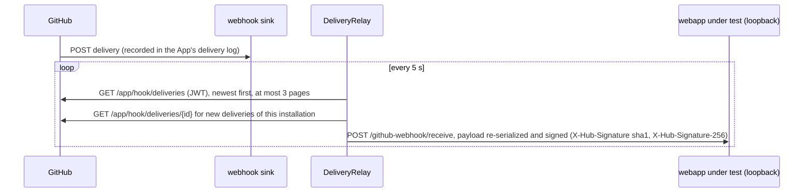

# The e2e GitHub App

The webapp under test is a GitHub App backend: it authenticates with an App id and private key, receives the App's
webhook deliveries at `/github-webhook/receive`, and acts on the organization with installation tokens. The harness
therefore needs its own GitHub App per test organization, created from a manifest by `otterdog-e2e app-manifest`.

## Permissions and events

The manifest requests exactly what otterdog's webapp needs (`appmanifest.DEFAULT_PERMISSIONS` and
`DEFAULT_EVENTS`); doctor and every webapp session check that the installation grants at least these.

| Repository permission | Access | | Organization permission | Access |
|---|---|---|---|---|
| Actions | write | | Administration | write |
| Administration | write | | Custom organization roles | write |
| Commit statuses | write | | Custom properties | admin |
| Contents | write | | Members | write |
| Custom properties | write | | Plan | read |
| Environments | write | | Secrets | write |
| Issues | read | | Variables | write |
| Metadata | read | | Webhooks | write |
| Pages | write | | | |
| Pull requests | write | | | |
| Secrets | write | | | |
| Variables | write | | | |
| Webhooks | write | | | |
| Workflows | write | | | |

Events: `issue_comment`, `pull_request`, `pull_request_review`, `push`, `workflow_job`, `workflow_run`
(`installation` events are always delivered).

The App is private (`public: false`) and named `otterdog-e2e-<org>` (truncated to 34 characters).

**Isolation (enforced).** The private key reaches the webapp under test, untrusted pull request images included, and
with it every installation of the App. Before the key is handed to a webapp stack (at every start), and for the
installation preflight, `safety.verify_app` therefore requires: `GET /app` names the test organization as owner
(`owner.type` Organization, `owner.id` = the pinned `E2E_ORG_ID`), and every installation listed by
`GET /app/installations` is an organization installation on the test organization (or on another id of
`E2E_ALLOWED_ORG_IDS` that is not denylisted); `installations_count` must not exceed the listing. Never reuse an
existing development or production App: an App owned by another account, or installed on another organization, fails
the webapp items (and doctor's `app:owner` row) instead of running them.

## Creating the App

Prerequisites: the organization passed `bootstrap --apply` (the command refuses an organization without the safety
marker), and you have a browser session as an organization owner (the admin machine account).

```bash
.venv/bin/otterdog-e2e app-manifest --target free --webhook-url https://<sink>/otterdog-e2e
```

1. The command verifies the organization, then serves an auto-submitting form on `http://127.0.0.1:8765/`
   (`--port` to change it). Open it in the browser: it posts the manifest to GitHub's "create GitHub App from
   manifest" page of the organization.
2. Confirm the creation on GitHub. GitHub redirects to `http://127.0.0.1:8765/callback?code=...&state=...`; the
   listener accepts only the `state` it generated, and never logs the request (it carries the code).
3. The command exchanges the code (`POST /app-manifests/<code>/conversions`, valid one hour) and writes, with mode
   0600 in `~/.config/otterdog-e2e/<target>/` (mode 0700):
   - `app-<id>.private-key.pem`,
   - `app-<id>.webhook-secret`,
   - `app-<id>.env`: `E2E_APP_ID`, `E2E_APP_SLUG`, `E2E_APP_PRIVATE_KEY_FILE`, `E2E_APP_WEBHOOK_SECRET`.

   The OAuth client id and secret of the conversion answer are discarded; nothing secret is printed.
4. Append the env snippet and install the App:

   ```bash
   cat ~/.config/otterdog-e2e/free/app-<id>.env >> ~/.config/otterdog-e2e/free.env
   ```

   Install it on the organization with **All repositories** (https://github.com/apps/<slug>/installations/new):
   the harness creates repositories during the run, and an installation limited to selected repositories is
   refused.
5. Run `bootstrap --target free --apply` again: it writes the webapp's `otterdog.json` to the configs repository and
   probes the deliveries.

If the browser step cannot reach the local listener (remote machine), copy the `code` parameter of the redirect URL
and run `otterdog-e2e app-manifest --target free --webhook-url <same URL> --exchange <code>` within the hour.

If GitHub returned no webhook secret, the command generates one, warns, and stores it: set the same value as the
App's webhook secret in its GitHub settings (the relay signs forwarded deliveries with the local value anyway).

## The webhook sink

GitHub refuses loopback webhook URLs, and the harness never exposes the webapp under test. The App webhook therefore
points to a **sink**: any HTTPS endpoint that answers 2xx. GitHub records every delivery (whatever the sink
answers) and the harness pulls them from the deliveries API.

- Prefer an endpoint you control (a static HTTPS endpoint that accepts POST and answers 204, for example).
- A smee.io channel can serve as a sink, but channels are public: anyone who knows the URL can read the payloads of
  the test organization.
- Never point it to a real otterdog deployment.

`app-manifest` refuses loopback URLs; doctor fails when the hook URL is missing or loopback, or when the content type
is not `json`, and warns when the App delivered nothing in the last 72 hours (inactive webhook).

## The pull relay

`webhooks/relay.py` replaces a tunnel:



- Only deliveries of the App's installation on the test organization (or `ping`/`installation` events) that are
  newer than the session's start are forwarded, deduplicated by id and guid, in delivery order. Each forward is
  recorded in `deliveries.jsonl` (no payloads).
- Limitations: delivery logs are kept for 3 days and may appear with a delay (minutes under load); GitHub's own
  signature is never exercised (the relay re-signs with the local secret); at most about 300 deliveries are paged
  back on the first poll; the JWT rate budget is guarded.
- During a test session the relay runs inside the session (compose and external transports). For manual work,
  `otterdog-e2e relay --target free --forward-to http://127.0.0.1:5000/github-webhook/receive` runs it standalone;
  it takes the org lease, so do not start a test session at the same time.

## Rotating credentials

- Private key: App settings, Private keys, generate a new key, update `E2E_APP_PRIVATE_KEY_FILE` (or the CI secret
  `E2E_APP_PRIVATE_KEY`), then delete the old key.
- Webhook secret: set a new one in the App settings and in `E2E_APP_WEBHOOK_SECRET` (env file and CI secrets).
- Suspending the installation revokes its tokens immediately; the webapp tiers are then skipped with the reason.

One App webhook is shared by every run on the organization, which is one more reason why sessions on an organization
are serialized (org lease, CI concurrency group `e2e-<target>`).

## The probe App of the web-UI tier (optional)

otterdog's `install-app` and `uninstall-app` (and `review-permissions`) work through the GitHub web UI, so the web-UI
tier ([web-ui-testing.md](web-ui-testing.md)) tests them with a second, harmless App, never with the e2e App
(uninstalling it would break the webapp and webhooks tiers; the target loader refuses the same slug):

1. create it in the test organization (Settings, Developer settings, GitHub Apps, New GitHub App): any name, any
   homepage URL, webhook **inactive**, **no** permissions, "Only on this account";
2. do NOT install it; the test installs it with `install-app -a <slug>`, checks `GET /orgs/{org}/installations`,
   uninstalls it with `uninstall-app -a <slug>` and checks again;
3. declare it in the target: `web_ui: {probe_app_slug: <slug>}`.

Since otterdog #693/#699 both commands resolve token-only credentials and fail at the web login with "username not
available" (known bug KB-002): the test is a non-strict xfail until it is fixed. If a fixed release installs the App
but cannot uninstall it, the next run uninstalls it first; otherwise remove it in Settings, GitHub Apps, Configure,
Uninstall. `review-permissions` (never with `-g`) only lists the pending permission requests of the installed Apps,
the e2e App included, and approves nothing.
