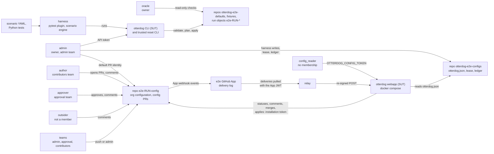
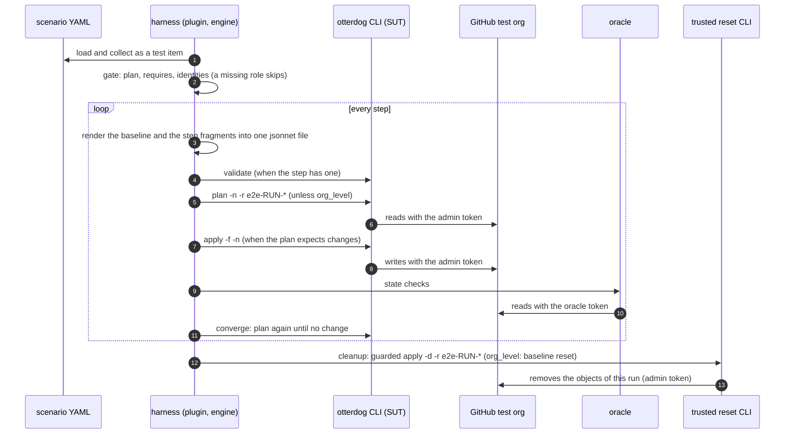
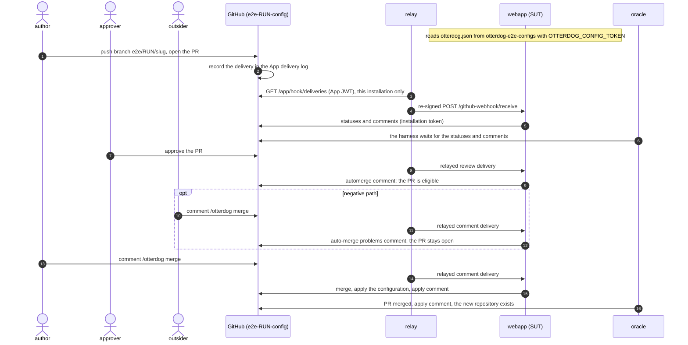
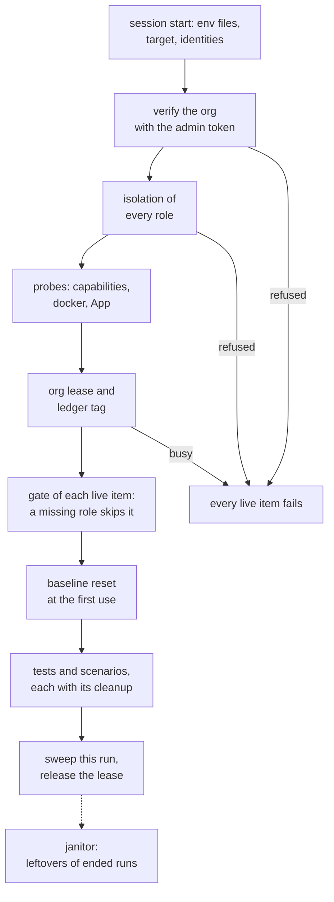

# Roles and interactions

The harness acts on the test organization as several GitHub accounts, one per **role**: `admin`, `oracle`,
`author`, `approver`, `outsider` and `config_reader`. This page explains why, what each role does in the tests, what
is skipped when one is missing, and how a scenario, the roles, otterdog and the test organization interact.

The setup of the accounts and their tokens is in [setup-free-org.md](setup-free-org.md) (by hand) and
[onboarding.md](onboarding.md) (`otterdog-e2e setup`); the security rules are in [security.md](security.md).

## Why roles

otterdog behaves differently depending on who acts:

- the webapp decides by the GitHub login and the teams of the PR author or of the commenter. A contributor's PR is
  offered for auto-merge only after an approval, an approval-team author needs none, `/otterdog done` and
  `/otterdog apply` are accepted from the admin team only, and `/otterdog merge` from a non-member is refused;
- the CLI validates teams against the organization's member list (`skip_non_organization_members`), and a team
  member must be an organization member (GitHub invites anybody else).

The roles cover these cases with **dedicated machine accounts**. Each account must belong only to test organizations:
every session checks it before it writes anything (`safety.verify_target`: memberships and pending invitations,
classic scopes or the fine-grained token proofs, and the outsider outside the test organization). See
[Dedicated machine accounts](security.md#dedicated-machine-accounts-t1-t2).

**One account per role.** Two roles never share a token and never declare the same login (compared
case-insensitively). Only `admin` and `oracle` may be one account: the oracle falls back to the admin when
`E2E_ORACLE_TOKEN` is unset (`settings.SHAREABLE_TOKEN_GROUPS`, `SHAREABLE_LOGIN_GROUPS`). A target that breaks the
rule does not load, and `setup` refuses a token or an account already stored for another role. A role is proven by its
account: bootstrap makes the oracle an owner, the outsider must stay outside the organization, and the webapp judges
the login that acted.

## The roles at a glance

| Role | Required | Account and membership | Token | What it does in the tests | When it is missing |
|---|---|---|---|---|---|
| `admin` | yes | owner; admin team (`otterdog-admins`) | classic or fine-grained | runs otterdog (SUT and trusted reset CLI), every harness write, the org lease, bootstrap, the janitor; default author of config PRs, merges and comments | the target does not load: every live item fails; the unit and offline tiers still run |
| `oracle` | no | owner (a separate account), or the admin itself | classic or fine-grained | independent read-only ground truth: scenario `state` checks, the waits of PR flows, lease and ledger reads, janitor scans | the admin token serves as oracle; nothing is skipped |
| `author` | for webapp flows | active, public member; contributors team (`e2e-contributors`) only | classic, or fine-grained once a member | opens config PRs and comments as a plain contributor; team member in `cli.team.members` | its tests are skipped |
| `approver` | for approval and auto-merge flows | active, public member; approval team (`project-leads`) | classic, or fine-grained once a member | approves config PRs, merges for an author, authors PRs as an approval-team member | its tests are skipped |
| `outsider` | for negative tests | **not** a member, nor invited | classic only | comments as a non-member; the non-member of team validation | its tests are skipped |
| `config_reader` | for webapp tests of untrusted SUTs | none needed | fine-grained, public repositories, no permission | the webapp's `OTTERDOG_CONFIG_TOKEN`; `check-token-permissions` with a scope-less token | webapp items of an untrusted SUT are skipped; a trusted SUT's webapp gets the admin token |

- Tokens: the classic scopes are in [3. Tokens](setup-free-org.md#3-tokens), the fine-grained permissions in
  [Permissions per role](setup-free-org.md#permissions-per-role), the allowed scopes and the isolation proofs in
  [security.md](security.md#fine-grained-personal-access-tokens-t1-t2).
- Teams: the names come from the target (`teams.admin`, `teams.approval`, `teams.contributors`, overridden by
  `E2E_ADMIN_TEAM`, `E2E_APPROVAL_TEAM`, `E2E_CONTRIBUTORS_TEAM`); the table shows the defaults. The baseline reset
  creates them with the **declared** logins as members, and gives them `push` (approval, contributors) and `admin`
  (admin team) on the run's org config repository `e2e-<run>-config`.
- "Skipped" means the plugin's gate skips the item before any fixture runs, with the reason
  `missing identities: <role> (set their token env vars)`.

A role is configured when its token variable is set (`settings.resolve_identities`). A login declared without a token
still names the account (baseline team members, `logins.<role>` in scenarios), but the role's tests are skipped and
doctor reports a `WARN` `env:<role>` row.

| Role | Login | Token | Declared kind |
|---|---|---|---|
| `admin` | `E2E_ADMIN_LOGIN` | `E2E_ADMIN_TOKEN` | `E2E_ADMIN_TOKEN_TYPE` |
| `oracle` | `E2E_ORACLE_LOGIN` | `E2E_ORACLE_TOKEN` | `E2E_ORACLE_TOKEN_TYPE` |
| `author` | `E2E_AUTHOR_LOGIN` | `E2E_AUTHOR_TOKEN` | `E2E_AUTHOR_TOKEN_TYPE` |
| `approver` | `E2E_APPROVER_LOGIN` | `E2E_APPROVER_TOKEN` | `E2E_APPROVER_TOKEN_TYPE` |
| `outsider` | `E2E_OUTSIDER_LOGIN` | `E2E_OUTSIDER_TOKEN` | `E2E_OUTSIDER_TOKEN_TYPE` |
| `config_reader` | `E2E_CONFIG_READER_LOGIN` | `E2E_CONFIG_READ_TOKEN` | `E2E_CONFIG_READ_TOKEN_TYPE` |

## Overview

Who talks to whom during a session. The machine accounts are tokens the harness holds: an arrow from a role is what
is done with that role's token. The repositories, the teams and the App on the right belong to the GitHub test
organization.

- The harness also starts the webapp (compose stack with the App key) and the relay, and the oracle reads every
  object the tests check, the config PRs, their statuses and comments included.
- In the diagrams `RUN` stands for the run id: names are `e2e-<run>-<slug>`, branches `e2e/<run>/<slug>`
  ([architecture.md](architecture.md#a-live-session)). With the default `org_config_repo: auto` each session creates
  its own org config repository `e2e-<run>-config`.
- The configs repository holds the webapp's `otterdog.json`, the org lease (`refs/heads/e2e-lease`) and one ledger tag
  per run (`refs/tags/e2e-run/<run>`).

## The roles

### `admin`

The only required role: an owner of the test organization and the member of the admin team.

- Its token verifies the organization (`GET /orgs/{org}`: exact login, pinned id, plan, safety marker).
- Every otterdog command of the harness runs with it (`E2E_OTTERDOG_API_TOKEN` of the generated `otterdog.json`):
  the SUT CLI of the scenarios and tests, and the trusted reset CLI of baseline resets, cleanups and PR guards.
- The harness writes as the admin through its `Mutator`: drift and fixtures of the tests, `otterdog.json` in the
  configs repository, the baseline on the main branch of `e2e-<run>-config`, the org lease and the ledger tag.
  `bootstrap` (invitations, marker) and the janitor use it too.
- It is the default identity of `ConfigRepoFlow`: it opens, pushes, merges and closes config PRs, comments and
  dismisses reviews unless a test names another role. As a member of the admin team its `/otterdog done`,
  `/otterdog apply` and `/otterdog update-branch` are accepted (`tests/webapp/test_merge_apply.py`,
  `tests/webapp/test_update_branch.py`).
- Signed in as the admin account, you create the GitHub App (manifest flow). The admin is also the only role with a
  web login: the web-UI tier logs it in ([web-ui-testing.md](web-ui-testing.md)).

Tests: every live test. `logins.admin` is available to every live scenario without declaring it, for example the
member counterpart of `scenarios/cli/teams/validate-team-non-member.yaml`.

Missing: the target does not load (`E2E_ADMIN_TOKEN (admin token) is not set`), so every live item fails with the
reason.

### `oracle`

The independent, read-only ground truth: an `Oracle` on a read-only client, never otterdog code.

- It answers the scenario `state` checks, the waits of the webapp flows (PRs, commit statuses, comments), the lease
  and ledger reads, the janitor's scans and doctor's checks.
- Without `E2E_ORACLE_TOKEN` the admin token serves as oracle, and `E2E_ORACLE_LOGIN` may be the admin's login. A
  separate oracle sets the capability `separate_oracle`.
- A separate oracle must be an **owner**: the org-level reads need it. Its classic scopes follow the admin's
  allowlist (`safety.OWNER_ROLES`); a fine-grained token gets the admin's permissions at Read, with two exceptions
  ([Permissions per role](setup-free-org.md#permissions-per-role)). doctor's `membership:oracle` row fails when it is
  not an owner.
- `bootstrap` invites a separate oracle as an owner (or promotes an active member) only when its own token answers
  `GET /user` with `E2E_ORACLE_LOGIN`: a declared login alone could name any account
  ([6. Memberships](setup-free-org.md#6-memberships)).

Tests: none requires it.

Missing: nothing is skipped.

### `author`

A plain contributor: an active and public member, only in the contributors team, with `push` on the run's org config
repository. It pushes its branch `e2e/<run>/<slug>` there, opens the PR and comments `/otterdog` commands.

Tests:

- `tests/webapp/test_merge_apply.py`:
    - W-AUTOMERGE: no auto-merge offer before the approval; after it, the author's `/otterdog merge` merges and
      applies;
    - W-MERGE-SECRET and W-CMD-APPLY: its `/otterdog done` and `/otterdog apply` get the wrong-team comments naming
      the admin team, and the PR record does not change;
    - W-AUTOMERGE-THIRD-PARTY: it authors the approved PR the outsider tries to merge;
    - W-AUTOMERGE-DISMISS: its `/otterdog merge` is refused once the approval is dismissed;
- `tests/webapp/test_commands.py`: W-CMD-TEAM-INFO, the team-info comment names the author, GitHub's author
  association and its teams; `author_can_auto_merge` is false;
- `tests/webapp/test_check_merge.py`: W-CMD-CHECK-MERGE-REFRESH, not eligible until it joins a run approval team,
  then `/otterdog check-merge` re-reads the membership (SUTs with the command only);
- `tests/webapp/test_update_branch.py`: W-CMD-UPDATE-BRANCH, the PR author may update its branch (SUTs with the
  command only);
- `scenarios/cli/teams/team-members.yaml` (`cli.team.members`): member of a run team, then replaced by the approver.

Notes:

- **Prior public activity.** GitHub tags the events of an account that never committed anything with the author
  association `FIRST_TIMER`, which otterdog's webhook models reject: the webapp drops the PR or comment
  ([KB-017](known-issues.md#kb-017--githubs-author_association-first_timer-is-not-accepted)). Push one commit to a
  public repository of the account first. The same holds for every account that opens PRs or comments (the admin, the
  approver, the outsider).
- A fine-grained token needs the active membership first, and an owner's approval when the organization requires it
  ([Fine-grained personal access tokens](setup-free-org.md#fine-grained-personal-access-tokens)).

Missing: the tests above are skipped.

### `approver`

An active and public member of the approval team. The webapp matches the team with the pattern `^project-leads$`
(`approval_teams` of the webapp's `otterdog.json`, `GITHUB_APPROVAL_TEAMS` of the compose stack). `ConfigRepoFlow`
approves and requests changes as the approver by default.

Tests:

- `tests/webapp/test_merge_apply.py`:
    - W-AUTOMERGE: its approval makes the contributor's PR eligible (automerge comment);
    - W-AUTOMERGE-AUTHOR-TEAM: as the PR author, auto-merge is offered without any review and its `/otterdog merge`
      merges; its invalid PR is refused as not valid and stays open;
    - W-AUTOMERGE-THIRD-PARTY: its `/otterdog merge` on the author's approved PR merges it;
    - W-AUTOMERGE-DISMISS: requested changes, then an approval the admin dismisses;
- `tests/webapp/test_update_branch.py`: W-CMD-UPDATE-BRANCH, neither the author nor an admin, its
  `/otterdog update-branch` is refused and the branch does not change;
- `scenarios/cli/teams/team-members.yaml` (`cli.team.members`): replaces the author as the team member, then stays a
  live member while `skip_members` leaves the list unmanaged.

Missing: the tests above are skipped.

### `outsider`

A GitHub account that is **not** a member of the test organization, nor invited. The isolation check refuses the
session otherwise, `bootstrap` stops (`the outsider ... is a member of the org: remove it first`) and doctor's
`membership:outsider` row fails. It comments on the public org config repository as a non-member.

Tests:

- `tests/webapp/test_merge_apply.py`: W-AUTOMERGE-THIRD-PARTY, its `/otterdog merge` on an approved contributor PR
  gets the auto-merge problems comment ("Only the author of the pull request, a member of ... is allowed to
  auto-merge.") and the PR stays open;
- `scenarios/cli/teams/validate-team-non-member.yaml` (`cli.validate.team-non-member`): a team with
  `skip_non_organization_members: true` and the outsider as member fails validation ("... who is not an organization
  member."); the same team with the admin validates. Validate only: nothing is applied, so GitHub never sends an
  invitation.

Notes: a classic PAT only. GitHub's fine-grained tokens cannot write to public repositories of an organization the
account does not belong to, so `token_type: fine-grained` is refused when the target loads, and a fine-grained token
fails the isolation check. Where classic PATs are forbidden, leave the role unset.

Missing: the tests above are skipped.

### `config_reader`

A read-only token with no membership: fine-grained, its own account as resource owner, repository access "Public
repositories", no permission.

- It becomes the webapp's `OTTERDOG_CONFIG_TOKEN`: the webapp reads its `otterdog.json` from the public configs
  repository with it. `E2EContext.config_token()` picks the config_reader token whenever it is configured; without
  it, a trusted SUT's webapp gets the admin token.
- The webapp tier of an **untrusted** SUT (`pr:N@sha`, a sha not reachable from upstream main or a `v*` tag)
  requires it: without it the plugin skips every item marked `webapp` (`tests/webapp/` and
  `tests/webhooks/test_app_delivery.py`), so the untrusted CI environment needs `E2E_CONFIG_READ_TOKEN`
  ([security.md](security.md#untrusted-suts-t1-t3)). The offline tier's webapp stacks use a dummy token.
- Its isolation check accepts any non-classic token and checks the memberships it can see. doctor's
  `scopes:config_reader` row fails a classic PAT and the admin's token.

Tests:

- `tests/cli/test_commands_read.py`: `cli.token-scopes`, `check-token-permissions` run with the config_reader token
  (no `X-OAuth-Scopes`) reports every scope otterdog needs as missing and exits 1.

Missing: `cli.token-scopes` and the webapp tier of untrusted SUTs are skipped.

## A CLI scenario

A live YAML scenario of `scenarios/cli/<domain>/`, run by `tests/cli/test_scenarios.py`
([writing-scenarios.md](writing-scenarios.md)). otterdog always runs with the admin token; only the oracle reads the
result.

The rendering fills the Jinja variables (`p`, `logins.<role>`, `teams.*`, ...): `logins.<role>` is the declared login
of a role. An `apply -d` is guarded by a plan with the same filter first: every removal must carry a purgeable run id.

## A webapp config PR

A test of `tests/webapp/` against the webapp under test. With the default `relay` transport the session first starts
the compose stack (with `OTTERDOG_CONFIG_TOKEN` and the App credentials), writes the baseline to the main branch of
`e2e-<run>-config` and `otterdog.json` to the configs repository (admin token), calls `/internal/init` and starts the
relay. The flow below is W-AUTOMERGE with the negative path of W-AUTOMERGE-THIRD-PARTY.

- Every relayed delivery follows the path of steps 3 and 4: GitHub records it, the relay pulls it from the App's
  delivery log and re-signs it with the webhook secret (`X-Hub-Signature`). The App's webhook URL is only a sink.
- Before a push, an approval, a merge or a `/otterdog merge|apply` comment, the harness checks the PR text with a
  `local-plan` of the trusted reset CLI (the guard), since the webapp applies merges with deletions.
- Each wait first waits for the delivery of the harness action: a delivery that never comes is an infrastructure
  problem `(infra)`, a webapp that does not react to it is a problem of the system under test `(SUT)`.
- The validation and sync statuses use the contexts `e2e/otterdog-validate` and `e2e/otterdog-sync` (target
  settings). In W-AUTOMERGE-THIRD-PARTY the approver comments the final `/otterdog merge`.

## A session

A live session, from its first live item to the janitor
([architecture.md](architecture.md#a-live-session), [security.md](security.md#org-lease-and-run-ledger-t4)).

- **Session start**, before the first live item: the env files, the target and the identities. The admin token is
  required; the oracle falls back to the admin.
- **Verify the org** (`safety.verify_target`, admin token): exact-case login, pinned numeric id, denylist of real
  organizations, plan, safety marker in the description.
- **Isolation of every role**: memberships and pending invitations only in allowed test organizations, the classic
  scopes of the role or the fine-grained token proofs, the outsider outside the test organization. One refused role
  refuses the whole session.
- **Org lease and ledger tag**: `refs/heads/e2e-lease` and `refs/tags/e2e-run/<run>` in the configs repository,
  renewed by a heartbeat; a busy lease fails the live items after `E2E_LEASE_WAIT` seconds.
- **Gate of each live item**: capabilities, plan, identities, docker, App, web UI, rate budget. A missing role never
  fails the session: only the items that need it are skipped, before any fixture runs.
- **Baseline reset** with the trusted reset CLI at the first item that uses the baseline: the teams with their
  declared members, the baseline repositories, the organization settings.
- **Sweep this run** (unless `--e2e-keep`), then release the lease and scrub the artifacts.
- **Janitor** (`make janitor`, the last step of a CI job, the scheduled `janitor.yml`): it only removes the objects of
  runs that are in the ledger and hold no unexpired lease.

## Adding a test that needs a role

- **Python test**: mark it with `@pytest.mark.identities(...)`, listing exactly the roles other than `admin` the
  test acts as: the `identity="..."` arguments of `ConfigRepoFlow` and `WebappScenario`, the approver behind
  `approve` and `request_changes` without one. `tests/unit/test_suite_webapp_static.py` checks the marker of the
  webapp and webhooks tiers. The fixtures `contributor_mutator` (the author), `approver_mutator` and
  `outsider_mutator` gate the same way.
- **Scenario**: declare `identities: [author, approver]` and use `{{ logins.author }}` in fragments, checks and
  expected texts. Every role but `admin` used in `logins.<role>` must be declared (the loader refuses the scenario
  otherwise); offline scenarios cannot declare roles. See [Scenario fields](writing-scenarios.md#scenario-fields) and
  [Template variables](writing-scenarios.md#template-variables).
- **This page**: name the new file in the section of each role it needs. `tests/unit/test_docs_roles.py` fails
  otherwise, and also when the table of [The roles at a glance](#the-roles-at-a-glance) stops listing exactly the
  roles of `settings.IDENTITY_ROLES`.

See [Python tests](writing-scenarios.md#python-tests) for the markers and fixtures.
